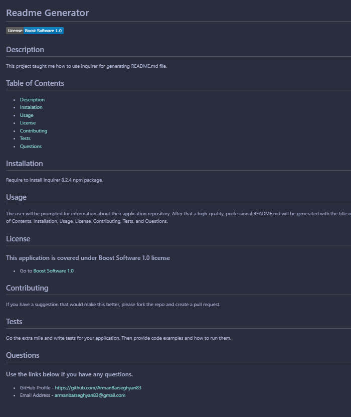

# Readme Generator

## Description

This project taught me how to use inquirer for generating README.md file.

## Usage

The user will be prompted for information about their application repository. After that a high-quality, professional README.md will be generated with the title of the project and sections entitled Description, Table of Contents, Installation, Usage, License, Contributing, Tests, and Questions.

Go to [Video demonstrating the functionality of the application](https://drive.google.com/file/d/1Ex69X2y5XGjQQEnIsUPxN-ExXIqx0F_m/view?usp=drive_link)

A sample README.md file generated using Readme Generator.

## Credits

Throughout this past year, I have completed different online courses and have previous programming experience by building my portfolio projects.

Please see my [Portfolio](https://armanbarseghyan83.github.io/portfolio/).
